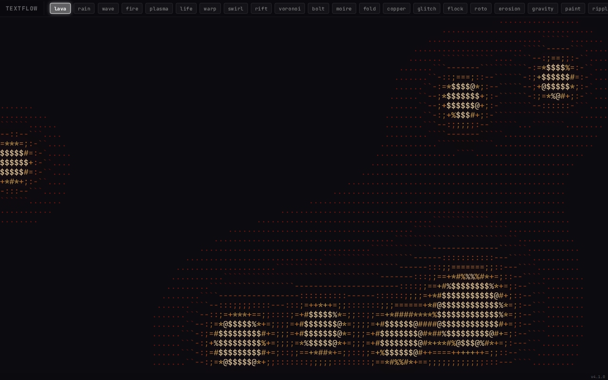
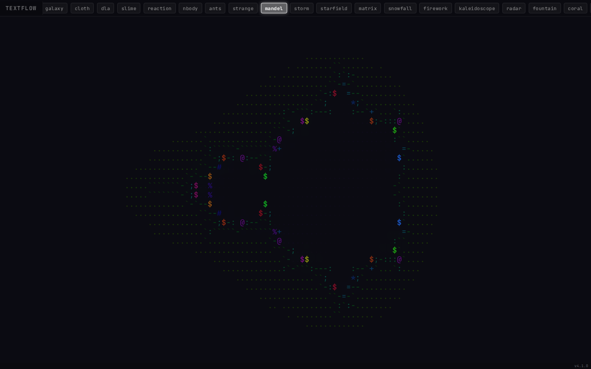
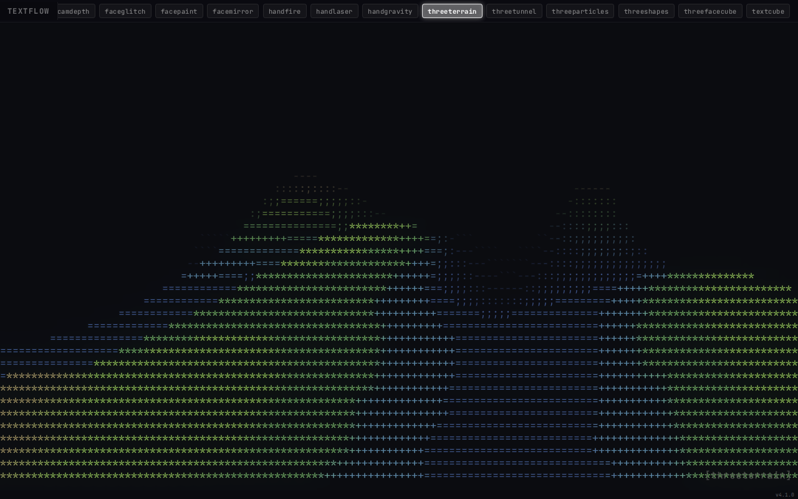
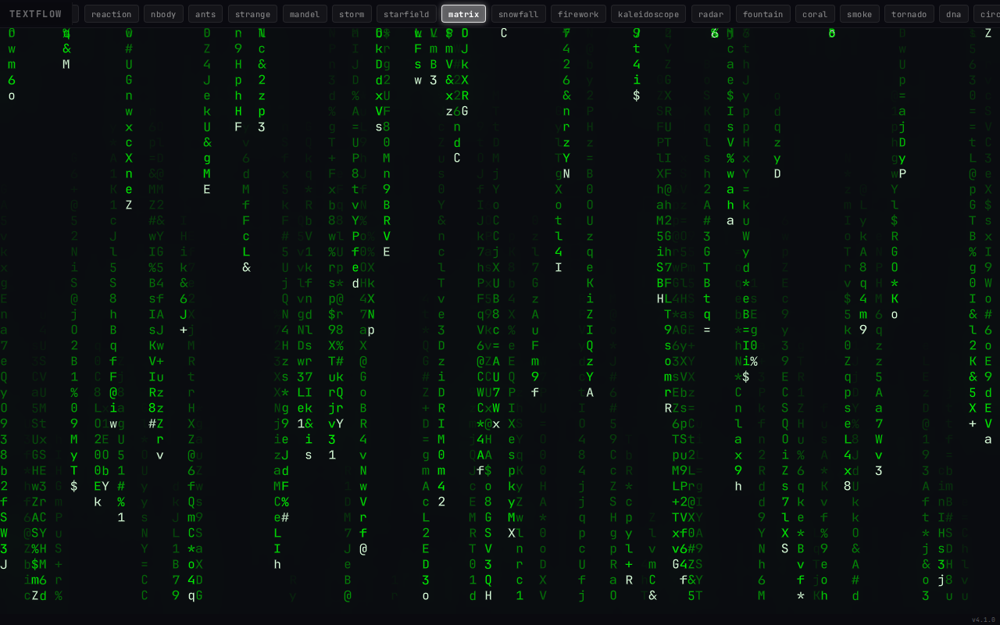
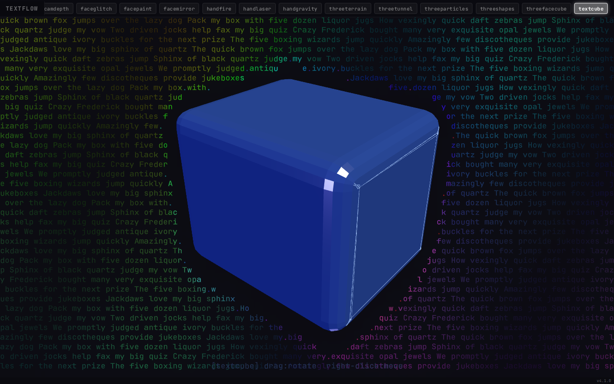
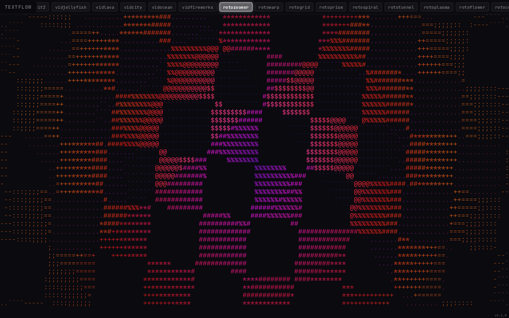
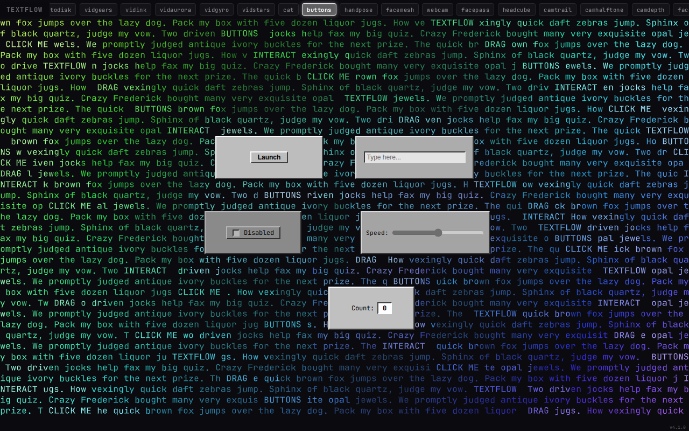
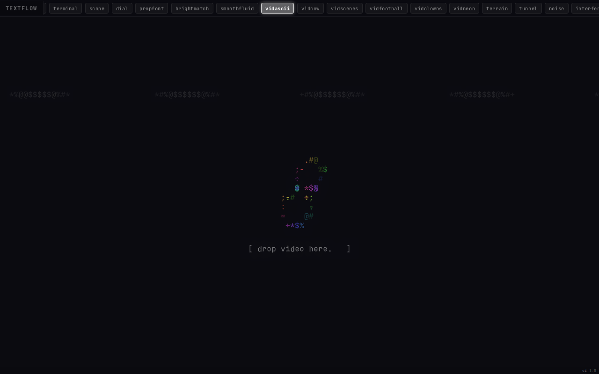

# textflow

**175 interactive ASCII art experiments** — lava flows, fractals, falling sand, 3D terrain, webcam effects, and more. All rendered as text characters in the browser.

[**Live Demo**](https://sebland.com/textflow)



## How It Works

textflow renders everything as ASCII characters on an HTML canvas. The core renderer uses **WebGL 2 instanced rendering** with an **MSDF (Multi-channel Signed Distance Field) font atlas** to draw thousands of characters per frame in a single draw call. A Kawase bloom post-processing pass adds the characteristic glow effect.

Each "mode" is a self-contained experiment that computes what character to draw at each grid position, with what color, every frame at 60fps.

### Rendering Pipeline

```
Mode compute (per-cell character + color)
    → drawChar / drawCharHSL API
    → WebGL 2 instanced quad batching
    → MSDF fragment shader (crisp at any size)
    → Kawase bloom post-processing
    → Single draw call output
```

Fallback: Canvas 2D with CSS blur glow for browsers without WebGL 2.

## Screenshots

| Mode | Description |
|------|-------------|
|  | **mandel** — Interactive Mandelbrot fractal. Click to zoom, smooth coloring with cycling hue. |
|  | **threeterrain** — 3D terrain flyover rendered by three.js, sampled back to ASCII characters with height-based coloring. |
|  | **matrix** — Digital rain with character cascades, varying speeds and brightness decay. |
|  | **textcube** — Three.js rendered 3D cube with rounded edges. Text flows around the cube silhouette using 4x supersampled masking. Right-click to move, scroll to resize. |
|  | **rotozoomer** — Classic demoscene rotozoom with rotating and scaling texture mapped to ASCII. |
|  | **buttons** — Interactive UI buttons rendered in ASCII with hover/click states. |
|  | **vidascii** — Real-time video-to-ASCII conversion. Drop any video file to see it rendered as text characters. |

## Mode Categories

### Core (30 modes)
Lava, rain, wave, fire, plasma, game of life, warp, swirl, rift, voronoi, bolt, moire, fold, copper, glitch, flock, roto, erosion, gravity, paint, ripple, sand, orbit, grow, magnet, shatter, pulse, worm, snake, bloom.

### Simulations (86 modes)
Fluid dynamics, strange attractors, Mandelbrot, cellular automata, wave equations, Lorenz system, galaxy simulation, cloth physics, DLA, slime mold, reaction-diffusion, n-body, Langton's ant, wave function collapse, and more.

### Video (16 modes)
Real-time video-to-ASCII with different visual styles — drop MP4/WebM files or use built-in video clips. Modes: vidascii, vidcow, vidscenes, vidfootball, vidclowns, vidneon, vidjellyfish, vidlava, vidcity, vidocean, vidfireworks, vidgears, vidink, vidaurora, vidgyro, vidstars.

### Rotozoomer (11 modes)
Demoscene-inspired rotozoom effects with different patterns and distortions.

### Retro (9 modes)
TV static, CRT scanlines, VHS tracking, terminal emulation, oscilloscope, and more nostalgic display effects.

### Three.js / R3F (7 modes)
3D scenes rendered by three.js, sampled back to ASCII or overlaid on the text canvas:
- **threeterrain** — 3D terrain flyover with height coloring
- **threetunnel** — Infinite tunnel with warping geometry
- **threeparticles** — Particle system with physics
- **threeshapes** — Morphing geometric shapes
- **threefacecube** — Webcam face texture on a 3D cube
- **textcube** — Glossy rounded cube with text flowing around its silhouette
- **r3fgem** — React Three Fiber rendered crystalline gem (first R3F mode)

r3fgem and textcube use analytical 3D→2D projection to rasterize geometry masks in pure JS — no GPU readPixels sync needed.

### Webcam / ML (16 modes)
Real-time webcam processing with MediaPipe machine learning:
- **webcam** — Raw webcam feed rendered as ASCII characters
- **cat** — Webcam with cat-ear overlay effects
- **buttons** — Interactive UI buttons rendered in ASCII with hover/click states
- **facemesh** — 468-point face mesh overlay
- **facepass** — Matrix-style face reveal with glitch effects
- **headcube** — 3D cube controlled by head rotation
- **faceglitch** — RGB channel splitting and data moshing on face
- **facepaint** — Painterly face rendering
- **facemirror** — Kaleidoscopic face mirroring
- **handpose** — 21-landmark hand skeleton tracking
- **handfire** — Fire particles emanating from hand landmarks
- **handlaser** — Laser beams between hand joints
- **handgravity** — Gravity wells at fingertips pulling ASCII particles
- **camtrail** — Motion trails from webcam feed
- **camhalftone** — Halftone dot pattern from webcam
- **camdepth** — Pixelated depth-style webcam effect

## Tech Stack

### WebGL 2 Instanced Rendering
The core renderer draws all characters in a **single instanced draw call**. Each character is a textured quad with per-instance attributes for position, character index, and color. This achieves 60fps even with 10,000+ characters on screen.

### MSDF Font Atlas
Characters are rendered using a **Multi-channel Signed Distance Field** atlas (JetBrains Mono). MSDF produces crisp text at any zoom level without texture blurring — each channel encodes distance to a different edge, and the fragment shader reconstructs sharp outlines from the intersection of the three channels.

### Kawase Bloom
Post-processing uses a **multi-pass Kawase blur** on bright pixels, blended back additively. This creates the characteristic glow effect around bright characters without the cost of Gaussian blur.

### Three.js (local npm dependency)
Six modes use three.js for 3D rendering. The 3D scene is rendered to an offscreen WebGL canvas, then either:
- **Sampled to ASCII**: The rendered pixels are read back and converted to ASCII characters with brightness/color mapping (threeterrain, threetunnel, threeparticles, threeshapes)
- **Overlaid**: The 3D canvas is positioned on top of the ASCII canvas, with the ASCII text flowing around the 3D object's silhouette using supersampled masking (textcube, threefacecube)

### React Three Fiber (R3F)
The `r3fgem` mode uses **React Three Fiber** — a React renderer for three.js. The 3D scene is defined declaratively with JSX components (`<Canvas>`, `<mesh>`, `<instancedMesh>`) and animated with the `useFrame` hook. This is the foundation for future R3F mode development.

### MediaPipe (Face Mesh + Hand Pose)
Webcam modes use Google's **MediaPipe** via CDN for real-time ML inference:
- **@mediapipe/tasks-vision** — Face landmark detection (468 points) and hand pose estimation (21 landmarks per hand)
- Models run in-browser via WebAssembly/WebGPU
- Results are mapped to the ASCII grid for character placement and coloring

## Architecture

```
src/
  core/
    engine.js       — Framework-agnostic init, loop, mode switching
    state.js        — Global state (canvas, dimensions, time, flags)
    draw.js         — drawChar() / drawCharHSL() API
    webgl-renderer.js — WebGL 2 instanced renderer + Kawase bloom
    atlas.js        — MSDF font atlas loader
    registry.js     — Mode registration (registerMode)
    router.js       — URL-based mode routing
    pointer.js      — Mouse/touch input handling
    glow.js         — Canvas 2D glow fallback
    loop.js         — scrollNavToMode utility
  modes/
    *.js            — 175 self-registering mode files
    groups/         — Lazy-loaded mode groups (code-splitting)
    modeGroups.js   — Mode-to-group mapping for dynamic imports
    index.js        — Barrel file (eager import for legacy build)
  components/
    R3FGem.jsx      — R3F crystalline gem overlay
  hooks/
    useTextflowEngine.js — React bridge hook
  App.jsx           — React app shell (Vite build)
  main.jsx          — React entry point
  entry.js          — Legacy esbuild entry point
static/
  *.mp4             — Video files for vid* modes
  jetbrains-msdf.*  — MSDF font atlas (PNG + JSON)
  og-roto.png       — OpenGraph preview image
```

## Build System

### Dual Build Paths

**Legacy (esbuild)** — Single inlined HTML file:
```bash
node build.js        # → dist/index.html (2.1 MB)
```

**Vite + React** — Code-split chunks:
```bash
npm run build:vite   # → dist-vite/ (253 KB initial, lazy chunks)
```

| Chunk | Size | Gzip | Loading |
|-------|------|------|---------|
| Core + React | 253 KB | 82 KB | Eager |
| Simulation (86 modes) | 107 KB | 39 KB | Lazy |
| Webcam/ML (16 modes) | 80 KB | 27 KB | Lazy |
| Three.js library | 681 KB | 172 KB | Lazy |
| R3F gem component | 158 KB | 50 KB | Lazy |
| Video (16 modes) | 20 KB | 4 KB | Lazy |
| Retro (9 modes) | 16 KB | 7 KB | Lazy |
| Roto (11 modes) | 9 KB | 4 KB | Lazy |

### Development
```bash
npm run dev:vite     # Vite dev server with HMR on port 3000
```

## Deployment

Docker container with nginx, reverse-proxied by Caddy:

```bash
docker compose up -d   # Builds and runs on port 20004
```

Served at `sebland.com/textflow` via Caddy reverse proxy with Cloudflare CDN.

## Adding a New Mode

1. Create `src/modes/mymode.js`:
```javascript
import { clearCanvas, drawCharHSL } from '../core/draw.js';
import { registerMode } from '../core/registry.js';
import { state } from '../core/state.js';

function initMymode() {
  // Called on mode switch — initialize state
}

function renderMymode() {
  clearCanvas();
  var W = state.COLS, H = state.ROWS;
  for (var y = 0; y < H; y++) {
    for (var x = 0; x < W; x++) {
      var hue = (x * 5 + state.time * 50) % 360;
      drawCharHSL('#', x, y, hue, 80, 40);
    }
  }
}

registerMode('mymode', { init: initMymode, render: renderMymode });
```

2. Add to `src/modes-list.js`, the appropriate group file in `src/modes/groups/`, `src/modes/modeGroups.js`, `src/modes/index.js`, and `src/core/glow.js`.

3. Build and test:
```bash
node build.js && npm run build:vite
```
